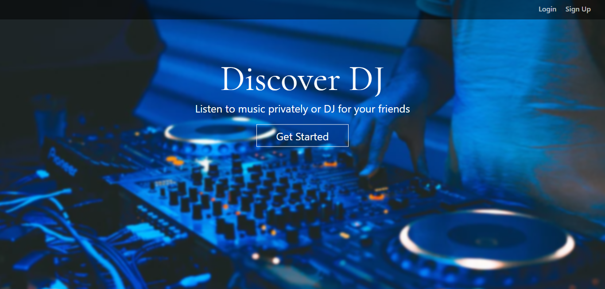
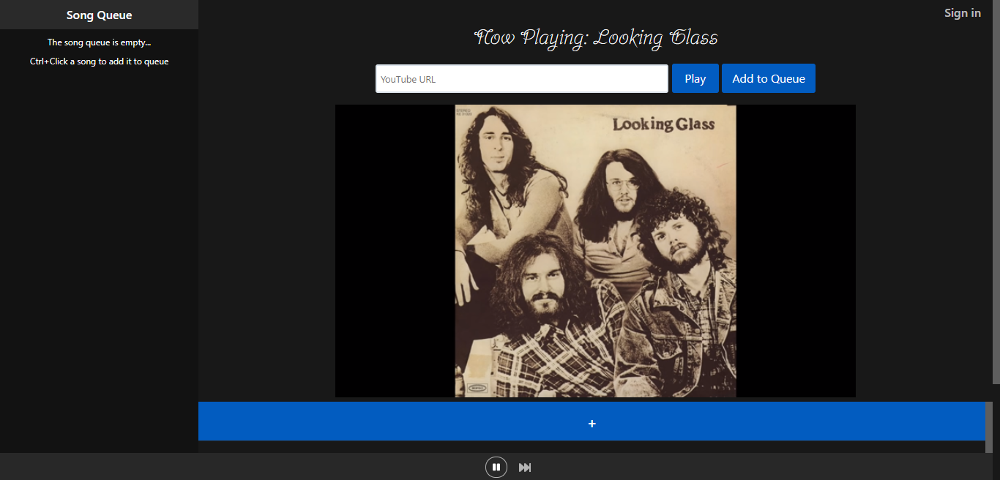
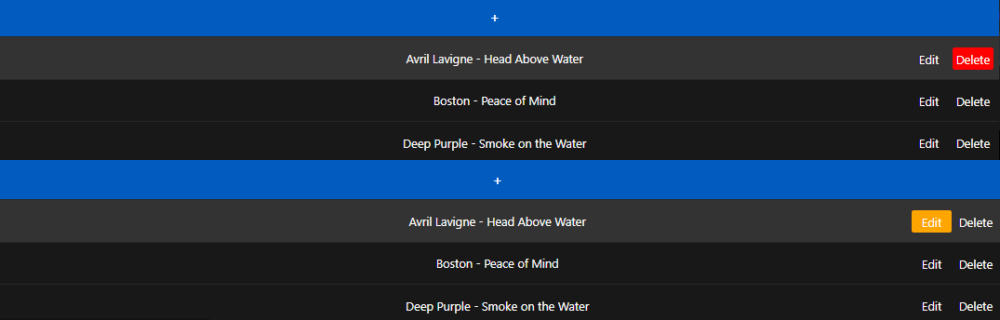
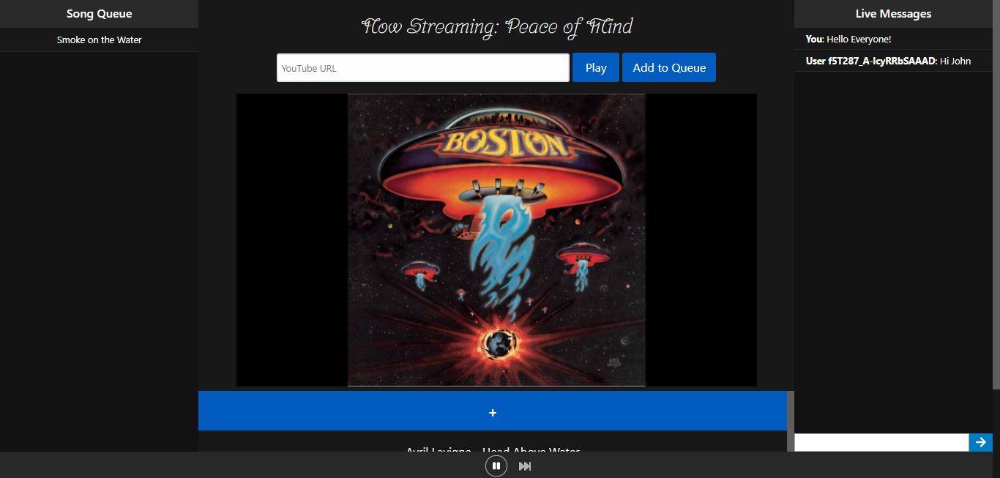
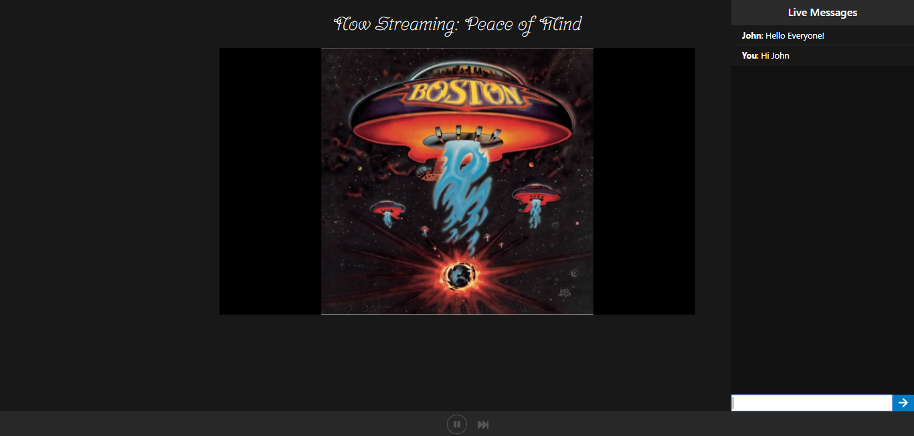

## Discover DJ

Discover DJ is a three-tier music sharing/streaming web application that enables users to listen to music alone or host a DJ lobby for their friends. It is built with Vue.js, Express, and WebSockets to ensure user concurrency and a responsive interface. 

__Landing Page:__  
  

__Music Player:__  
  
The main application page enables users to play songs from data in the database or provide their own YouTube URL  

__Admin View:__  
  
Everyone has the ability to add songs, but only administrators have the ability to edit or delete them  

__DJ/Streamer Page:__  
  
The DJ page closely resembles the main player, but introduces a chat system. Users that have not been authenticated are assigned a random id and are able to interact with the chat.  

__Stream Viewer Page:__  
  
The contents of the player are abstracted from the viewer so that they are presented with only UI elements that they can interact with

## Running Locally
__1. Project Setup__  
To run the project locally, you must first install the npm dependencies. Assuming you have [Node.js](https://nodejs.org/en/download/) installed, navigate to project directory and run `npm install`. This will install the dependencies required for the project. 

__2. Environment Variables__  
All of the dependencies should be installed now, but the server won't be able to find all of the information it needs to run. Create a file named `.env` and inside add the following three lines, filling in necessary information:
```
DB_URL=[link to remote or local mongoDB]
NODE_ENV=dev
PORT=5000
```

Example:
```
DB_URL=mongodb://localhost/sample_db
NODE_ENV=dev
PORT=5000
```

__4. Running Client and Server__  
To start the server, run `node server.js` in the main project directory. Do __not__ close the terminal! The server will need to run throughout the testing duration. In another terminal instance, run `npm run dev` inside the main project directory. Once the client deployment script has finished, you can view the application in the browser at [http://localhost:3000](http://localhost:3000).

## Technical Components
- __Vue.js:__
  - Prior to working on this project, I had no experience working with Vue.js, but many aspects of the project depended on conditionally rendered components, which is something Vue.js excels at. After following several tutorials and videos relating to Vue.js (most notably a [Vue.js Crash Course](https://www.youtube.com/watch?v=z6hQqgvGI4Y)), I was able to pick up the core concepts that enabled me to create a Vue.js application.
  - Vue.js components made the project code and HTML much more readable. Additionally, Vue has native support for locally scoped styles, enabling components to be styled however they need, without having to worry about styles being inherited
- __Vuex:__
  - Instead of duplicating code to process and pass information between components, this project took advantage of the Vuex state management pattern. The usage of a centralized store for all of the components allowed reusable data to be stored in one global instance, so that multiple copies of the same data were not floating around. This was a huge time saver in terms of debugging because I did not have to worry about data being resent to all the components when something changed.
- __Express:__
  - The use of the Express framework to create an http server and serve files made the server side code more much compact and readable. Additionally, the use of body parser  eliminated the need to write long stream parsing algorithms to extract data from request bodies. Express helped manage routes and database calls in a concise and intuitive manner.  
- __Custom Rooms/Namespaces:__
  - Socket.IO was used on the DJ page to maintain concurrency by sending player update events from the host client to the viewer clients. Some more complex aspects of Socket.IO coupled with dynamically generated routes were explored in this project. Every hosted DJ page has its own set of users. The application can handle more than one hosted lobby at a time and in order to accomplished this, custom name spaces had to be generated for each host. When John emits a pause event, only the players of his viewers should update (similarly for the messaging). The users listening to Greg's stream should not be affected by what John does in his lobby.
- __Dynamic Route Generation:__
  - The use of the Vue Router as well as custom middleware, enables routes to be created and validated as new users accounts are created. This prevents users from accessing streaming pages of users that do not exist. Assuming John is the username of an existing account, visiting John's DJ page (/music/John) would result in John's DJ page being loaded, but if the user accidentally types `/music/Johhn` (assuming the user Johhn does not exist) they will be presented with a 404 page and will hopefully realize that they made a typo.
- __Axios Proxy:__
  - In order to run the Vue.js application on the same Heroku app as the Express server, the Axios client was used to make XMLHttpRequests between the Vue.js application and Express server that were running on different ports with the same hostname. 

## Design Components
- __Song Queue:__
  - Users do not want to cycle through browser tabs every time a song ends. The song queue implementation enables users to control-click songs to add them to the queue (This also works with songs not stored in the database by clicking the 'Add to Queue' button when searching for a song). If no songs are being played, the queued song will immediately begin to play. When a song ends, if there are songs in the queue, the song next in the queue will begin to play without user interaction. Songs can also be removed from the queue by control-clicking them in the queue.
- __Scalability:__
  - Initially, to reduce latency between clients, the video streams were fetched by the server and another stream was created to relay packets to the clients. This kept latency between users to a minimum, since the server held the playback state and it was the single access point for all clients. This architecture was tested by requiring seven individuals to simultaneously connect to a stream. With this setup, the streams were almost perfectly in sync between two or three users, but with seven, the server became overloaded.
  - To resolve this problem, each client was given its own player and was responsible for updating itself based on socket events emitted by the client that was hosting the lobby (effectively peer-to-peer). Since the clients have to receive events before any actions can occur, more latency was introduced, but the server was able to handle many concurrent sessions without bottlenecking.
  - Also, to reduce latency as much as possible, player event emissions contain a timestamp field, so that if the clients become more than 5 seconds out of sync, they will adjust according to the host's parameters.
- __Dynamic Rendering:__
  - The application takes advantage of various user authentication levels to determine what a given user should see and be able to do. As seen in the images above, users that are logged in will be able to create their own DJ lobby, which will render the music player, messenger, and song queue, however if another user navigates to that lobby, with the same URL, and they are not authenticated, they will only see the player and messenger. This dynamic rendering was not only used to conditionally render components but to apply styles as well. For example, if a user owns the DJ page, the player component will only take up 60% of the screen (as opposed to 80%) in order to account for the additional components. When a user joins a DJ lobby, if a song is not playing, they are presented with a welcome banner stating, "Welcome To [username]'s Lobby", where as the owner will see the message "Welcome To Your Lobby"  
- __Guest Mode:__
  - The application has a secure authentication system that utilizes password hashing and salting, but if users are not inclined to sign up or are uninterested in hosting lobbies, they can take advantage of the guest mode. Naturally, users that are not signed in will by default be in guest mode. Guest mode enables the users to take full advantage of the media player, song queue, and other live streams. The only things that a guest cannot do are host their own lobby or perform any admin actions. In a live stream, guests are permitted to use the chat system and will be assigned a unique and temporary user Id.
- __Restful Routing:__
  - The application's navigation links will enable the user to go where they want with the click of a button. However, the user may want to type in the url to go directly to a specific page. In this case, the application's nested routes are intuitive and easy to remember. To provide some examples, the login page is located at `/login`, the music player is located at `/music`, and a user's DJ/streaming page is located at `/music/[username]`. For this application, the server is mostly used as an API for the database. The restful routes enable developers to interact with the server without ever needing to see its contents. For example, to retrieve song data from the database, a GET request can be made to `/songs` and likewise, to add a new song to the database, you would send a POST request to `/songs`
- __Icons:__
  - Following the design guidelines outlined in [Icon Usability](https://www.nngroup.com/articles/icon-usability/), to provide a more aesthetically pleasing UI and create more open space without lessening usability, Font Awesome Icons were placed in several locations (namely, the music player controls, and live stream messenger) instead of buttons with text.
- __Dark Theme:__
  - A lot of applications are trending towards a dark theme because it reduces the amount of strain put on the eyes. Since this application is a highly visual project as opposed to one that contains a lot of text, following the guidelines presented in [The Power of the Dark Side: Dark User Interfaces](https://www.shopify.com/partners/blog/dark-ui), having a dark background creates a contrast between components, enabling important features/components to be highlighted.
- __Fixed UI Components:__
  - Instead of placing the player controls, song queue, and messenger arbitrarily on the screen and requiring users to scroll up and down to access important components of the application, the UI components were placed at a fixed location on the screen, so that no matter how far up or down a user scrolls, they can quickly take advantage of the application's core features (songs could be paused or messages could be sent instantly).
